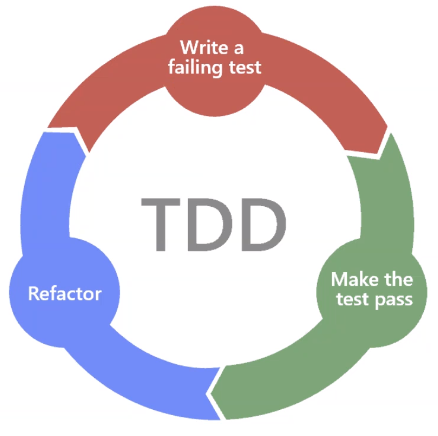
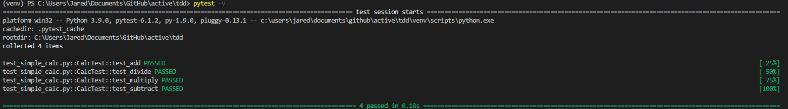
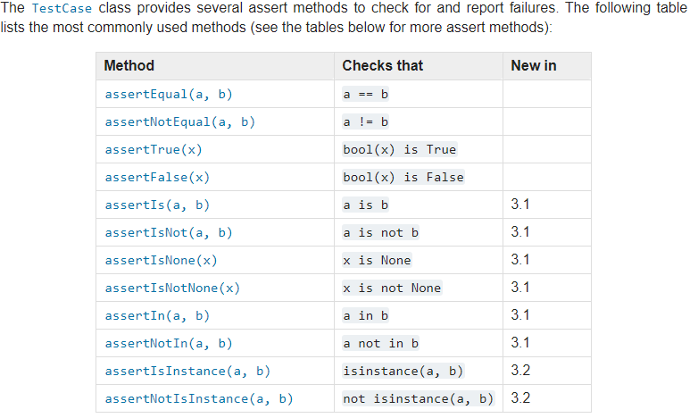

# TDD - Test Driven Development




**Types of testing**
- Unit testing
- TDD


**Python**
- Python has several modules that one can use to test one's code:
    1. PyTest
    2. UnitTest

**Why TDD?**
- Allows one to minimise the risk of a product potentially failing when deployed

**Steps**
1. Create a file to write tests
2. Run the test - they will fail
3. Create a file to write code
4. We will refactor and add the code to pass the tests

**Naming convention - Important**
- code file: ```simple_calc```
- test file: ```test_simple_calc```

<br>
---

**Example**
- Install the required frameworks ```pip install pytest```
- We then write the ```test_simple_calc``` file first:
    ```python
        # Write a class to write our tests
        class CalcTest(unittest.TestCase):
        # Create an object of the class we are testing
        calc = SimpleCalc()

        # IMPORTANT - Must use the 'test' word in our methods

        # We are asking python to test if 2 + 4 = 6
        def test_add(self):
            self.assertEqual(self.calc.add(2, 4), 6)

        # Test if 4 - 2 =2
        def test_subtract(self):
            self.assertEqual(self.calc.subtract(4, 2), 2)

        # Test if 2 x 2 = 4
        def test_multiply(self):
            self.assertEqual(self.calc.multiply(2, 2), 4)

        # Test if 6 / 3 = 2
        def test_divide(self):
            self.assertEqual(self.calc.divide(6, 3), 2)
    ```
- We can use two testing commands:
    1. ```python -m unittest``` or ```python -m unittest discover -v```
    2. ```python -m pytest``` or ```pytest``` or ```pytest -v```

- We then write the actual code based on fixing these errors. So let's create the ```simple_calc``` file:
    ```python
        # This file contains functional code to pass the test
    class SimpleCalc:
       
       def add(self, num1, num2):
           return num1 + num2
    
       
       def subtract(self, num1, num2):
           return num1 - num2
       
       
       def multiply(self, num1, num2):
           return num1 * num2
       
       
       def divide(self, num1, num2):
           return num1 / num2
    ```
- This is after creating all required functionalities to PASS the test file
- Running the tests again should yield:



---
<br>

**What's Important?**
- When writing the test class, you must inherit ```unittest.TestCase```
- The methods in the test class must start with ```test_```
- Choose correct assert methods based on what you want (possible asserts are at the bottom of the page)
    ```python
    class Test(unittest.TestCase):

        def test_case1(self):
            
    ```

---
**Notes**

- [Source](https://docs.python.org/3/library/unittest.html#assert-methods) 
    

